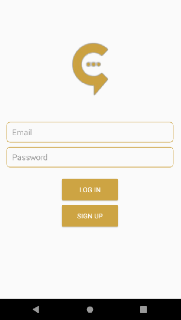
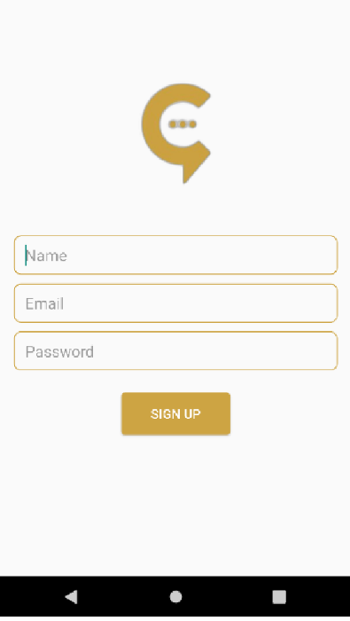
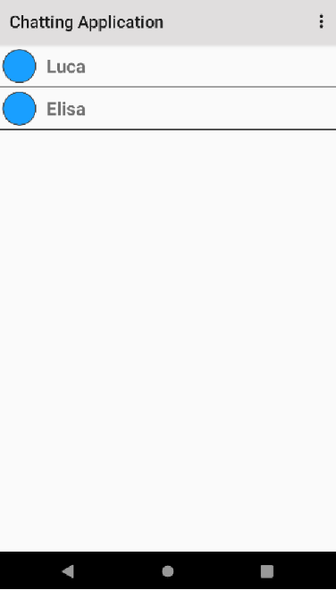
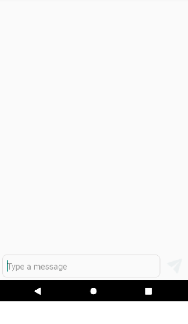

<div>
    
    
</div>

### Login
The Login page is connected to the Sign Up one. When in the Login page teh Sign Up button is clicked, the page changes.
``` kotlin
btnSignUp.setOnClickListener {
  val intent = Intent(this, SignUp::class.java)
  startActivity(intent)
}
```
<br>To authenticate each user, Firebase gives us a lot of methods to do it. Here, we will use e-mail and password.<br>If the Login is succesful, we jump to the Chat List page, if it is not, a message appears to notify the error.
``` kotlin
...
```


### Sign Up
For the Sign Up we collect an extra value: the name.
``` kotlin
...
```
<br>We also need to add a node to the Database to create a new user
``` kotlin
...
```


### Realtime Database


### Chat List
In this part all the users are shown.
``` kotlin
... RecyclerView
```


### Chat
What is wrote in the typing box is added to the Database. Next, the sent message is added to the message list.
<br>The getItemViewType returns an integer depending on who sent the message. According to the number the function returned, the corresponding layout is decided.
``` kotlin
...
```

